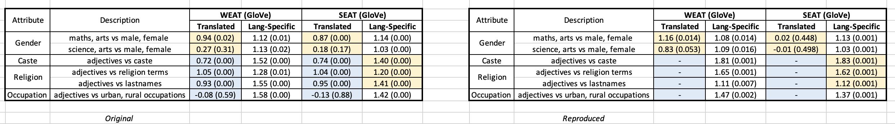
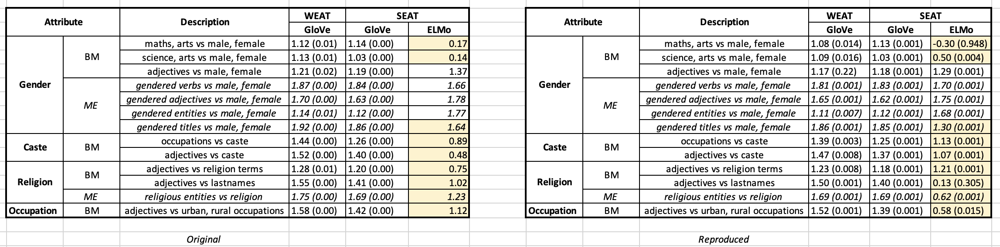

# Socially Aware Bias Measurements for Hindi Language Representations

This repository contains the code for the NAACL 2022 paper : <br><br>
Socially Aware Bias Measurements for Hindi Language Representations <a href="https://arxiv.org/pdf/2110.07871.pdf"> [Link to Paper]</a>

## Reproduction steps

```bash

# 0. Clone the repository (you should have git installed)

git clone "https://github.com/iamshnoo/soc_bias"

# 1. Create a virtual environment (Any python version >= 3.6 should work)

cd soc_bias
python3 -m venv social_bias
source social_bias/bin/activate
pip install numpy scipy simple_elmo tensorflow tqdm
pip install -e .
git clone https://github.com/facebookresearch/fastText.git
cd fastText
pip install .
cd ..

# 2. Download word embeddings

cd src
python download_elmo.py (embeddings stored in src/elmo_models)
python download_glove.py (embeddings stored in src/glove_models)
cd ..

These downloads attempt to download very large files from a website.
In case they don't work, we have included the relevant files in this repository via git-lfs.
Look for src/elmo_archive.zip and src/glove_archive.zip

src/elmo_models/hi should contain the unzipped files inside elmo_archive.zip,
namely model.hdf5 and options.json and vocab.txt
src/glove_models/hi should contain the unzipped contents of glove_archive.zip
namely 50/glove/hi-d50-glove.txt, 50/glove/hi-d50-vocab.txt,
300/glove/hi-d300-glove.txt, 300/glove/hi-d300-vocab.txt

Another alternative to git-lfs is to download the files from the following links
manually and place them in the relevant folders :
elmo - wget "https://www.cfilt.iitb.ac.in/~diptesh/embeddings/monolingual/contextual/hi.zip"
glove - wget "https://www.cfilt.iitb.ac.in/~diptesh/embeddings/monolingual/non-contextual/hi.zip"

# 3. Run the experiments

cd src
python seat_test.py (Use the --help flag to see the options)
python weat_test.py (Use the --help flag to see the options)
cd ..

# 4. Dataset (provided)

data/seat (contains SEAT data)
data/weat (contains WEAT data)

each of these 2 folders have subfolders for a language.
For the reproduction of results in hindi, we have the subfolder `hi` in each of these folders.
The `hi` folder contains 2 subfolders for `trans` and `lang_spec` corresponding to whether you want to use translated data or language specific data as mentioned in the paper.

data/seat/hi also has a file called "templates.jsonl" which contains the templates used to generate the SEAT sentences from the WEAT word lists using the file "src/generate_seat_data.py" with the command "python generate_seat_data.py". Only lang_spec data is to be used for this process. Translated data for SEAT is to be obtained by directly translating the corresponding english SEAT sentences using google translate.

So, we have the following data folders for Hindi for example :
WEAT Hindi Translated data : data/weat/hi/trans (translate data/weat/en files using google translate)
WEAT Hindi Language Specific data : data/weat/hi/lang_spec (use manually created word lists defined in the paper appendix)
SEAT Hindi Translated data : data/seat/hi/trans (translate data/seat/en files using google translate)
SEAT Hindi Language Specific data : data/seat/hi/lang_spec (use the templates.jsonl file as input to the generate_seat_data.py file to generate the SEAT sentences)

# 5. Results (provided)

results/seat/hi/lang_spec (contains results from glove and elmo)
results/seat/hi/trans (contains results from glove)
results/weat/hi/lang_spec (contains results from glove)
results/weat/hi/trans (contains results from glove)

These 4 result files are sufficient to reproduce the results in Table 1 and 2 in the paper.

In the json files that we have for results, here is what each of the numbers represent:

id = 7,  Description = maths, arts vs male, female
id = 8,  Description = science, arts vs male, female
id = 11, Description = adjectives vs male, female
id = 12, Description = gendered verbs vs male, female
id = 13, Description = gendered adjectives vs male, female
id = 14, Description = gendered entities vs male, female
id = 15, Description = gendered titles vs male, female
id = 16, Description = occupations vs caste
id = 17, Description = adjectives vs caste
id = 18, Description = adjectives vs religion terms
id = 19, Description = adjectives vs lastnames
id = 20, Description = religious entities vs religion
id = 21, Description = adjectives vs urban, rural occupations

Translated data are only available for id 7 and 8, because we only have English SEAT data for these 2 ids. Language specific data is available for all ids.

The results in Table 1 and 2 are of the form : effect_size (p_value) corresponding to each of the ids given here.
```

## Results



Blank represents results that cannot be reproduced because english word/sentence
lists are not available for this directly and hence cannot be translated. These
are highlighted in blue.



Yellow represents significant difference between reproduced results and the
results in the paper, for both the tables.
